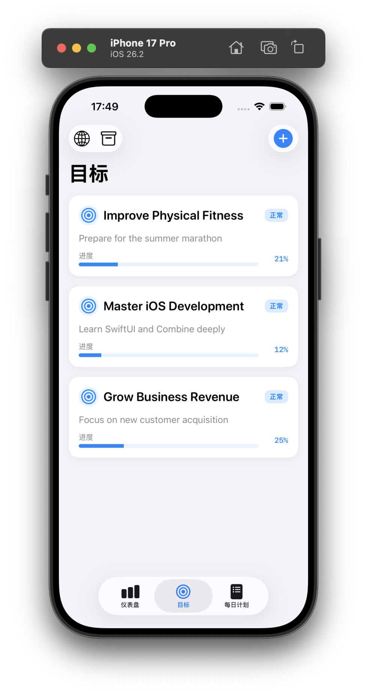
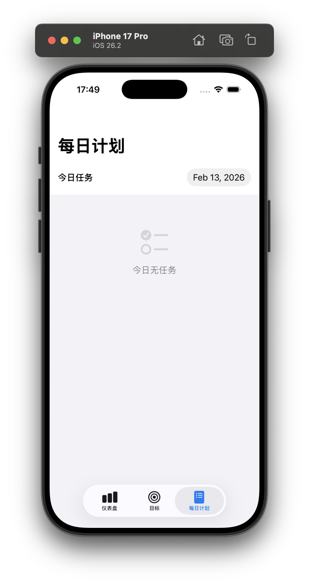

<div align="center">

# OKR Tracker

**让目标触手可及，让进步清晰可见**

[](https://swift.org)
[](https://developer.apple.com/xcode/swiftui/)
[](https://www.apple.com/ios/)
[](LICENSE)

[English](README_EN.md) | [简体中文](README.md)

</div>

---

## 📖 简介

**OKR Tracker** 是一款基于 **SwiftUI** 构建的原生 iOS 应用，旨在通过科学的 **OKR (Objectives and Key Results)** 方法论，帮助个人和团队高效管理目标。

不同于传统的待办事项应用，OKR Tracker 将**宏大的愿景**拆解为**可量化的关键结果**，并通过**每日的具体行动**（Tasks）来驱动进度更新。它内置了强大的可视化图表和 GitHub 风格的活跃热力图，让你对每一次努力都了然于胸。

## ✨ 核心亮点

### 🎯 深度目标管理
*   **多维度追踪**：支持数值、百分比、货币、布尔值（是/否）等多种关键结果类型。
*   **智能加权**：为每个关键结果设置“学分”权重，真实反映不同任务对总目标的贡献度。
*   **自动归档**：目标达成后自动归档，保持专注清单的整洁。

### 📅 目标驱动的每日计划
*   **关联执行**：每一个日常任务都直接绑定到具体的关键结果，拒绝无效忙碌。
*   **灵活重复**：支持每日、每周、工作日等多种循环模式，轻松养成习惯。
*   **即时反馈**：完成任务 = 进度增长。看着进度条随每一次打卡而前进，获得满满成就感。

### 📊 沉浸式数据洞察
*   **全景仪表盘**：首页展示所有进行中目标的平均进度与健康状态（正常/风险/滞后）。
*   **交互式图表**：点击进度卡片，展开全屏面积图，回溯每一个时间节点的进步曲线。
*   **活跃热力图**：复刻 GitHub 贡献图体验，用绿色方块记录你的奋斗足迹，支持按目标筛选查看。

## 📱 应用截图

<div align="center">
  
  
  
</div>


## 🛠 技术栈

*   **语言**: Swift 5
*   **UI 框架**: SwiftUI
*   **数据可视化**: Swift Charts
*   **架构模式**: MVVM (Model-View-ViewModel)
*   **本地存储**: JSON Persistence (无网络依赖，数据完全掌握在你手中)
*   **兼容性**: iOS 16.0+

## 🚀 安装与运行

1.  **克隆项目**
    ```bash
    git clone https://github.com/yourusername/OKRTracker.git
    ```

2.  **打开项目**
    使用 Xcode 打开 `OKRTracker.xcodeproj`。

3.  **运行**
    选择模拟器（推荐 iPhone 14 Pro 及以上）或连接真机，点击 **Run (Cmd+R)**。

## 🤝 贡献指南

欢迎任何形式的贡献！无论是发现 Bug、提出新功能建议，还是直接提交 Pull Request。

1.  Fork 本仓库
2.  创建你的特性分支 (`git checkout -b feature/AmazingFeature`)
3.  提交你的修改 (`git commit -m 'Add some AmazingFeature'`)
4.  推送到分支 (`git push origin feature/AmazingFeature`)
5.  开启一个 Pull Request

## 📄 许可证

本项目基于 MIT 许可证开源 - 详情请参阅 [LICENSE](LICENSE) 文件。
